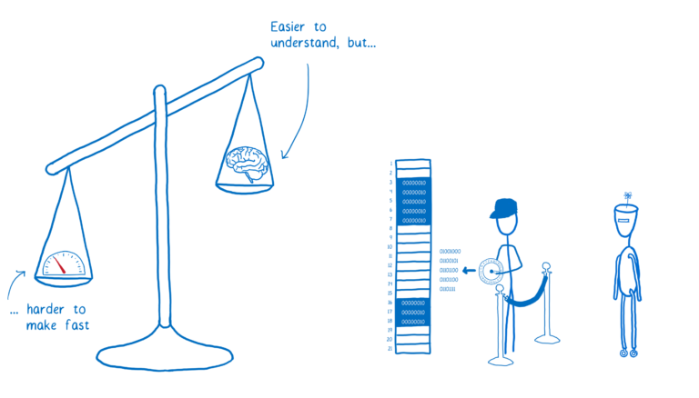
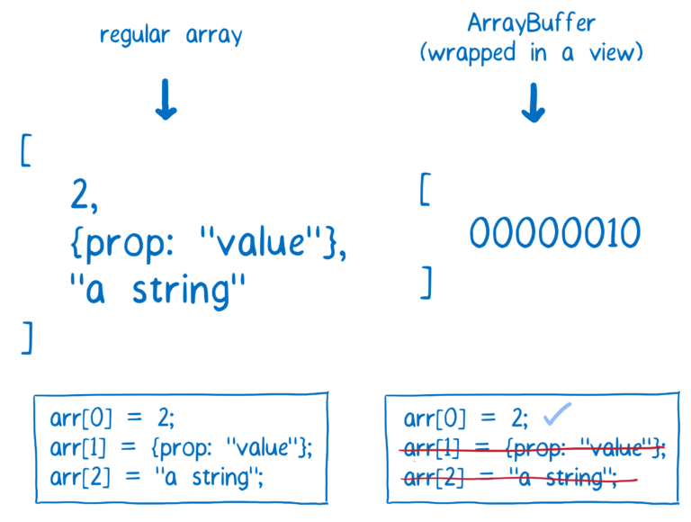
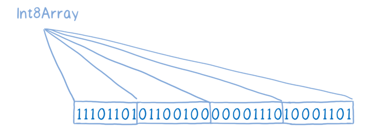
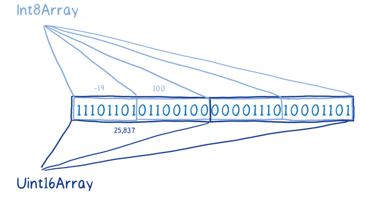
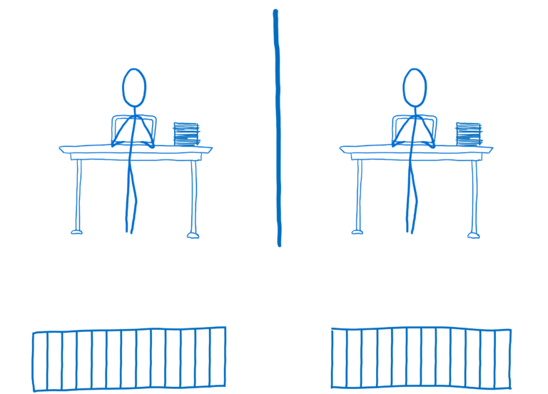
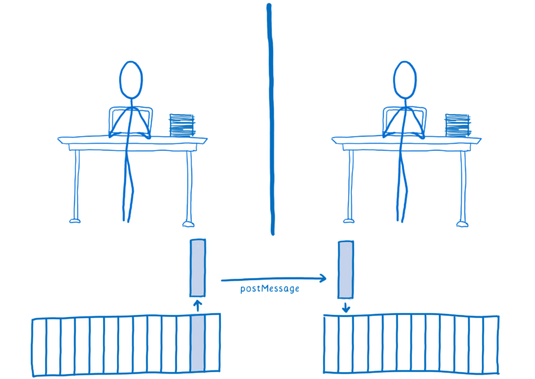
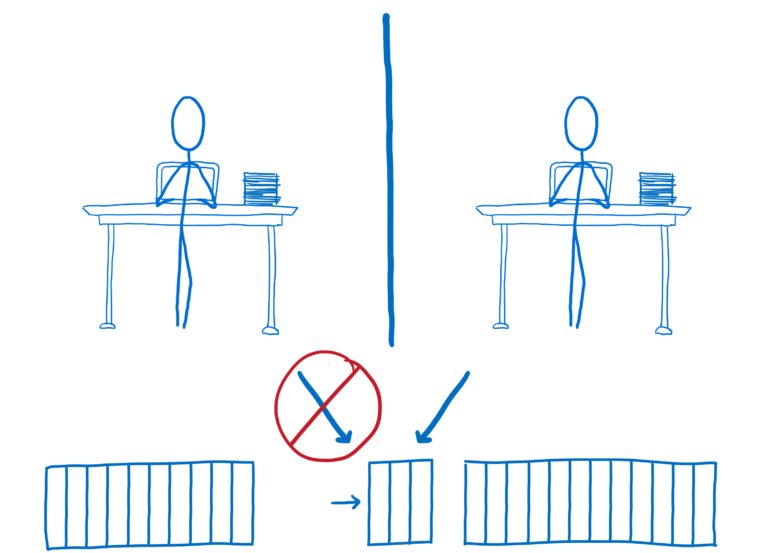
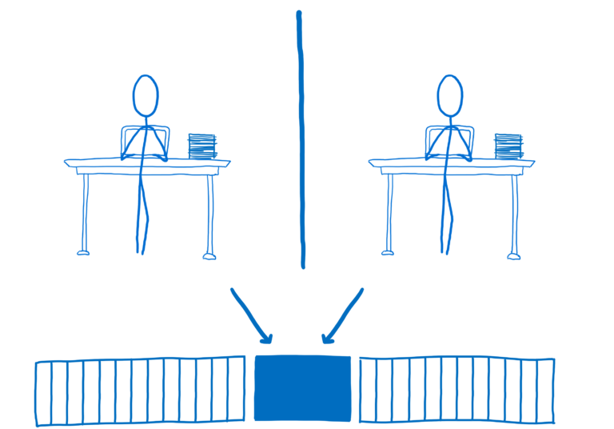
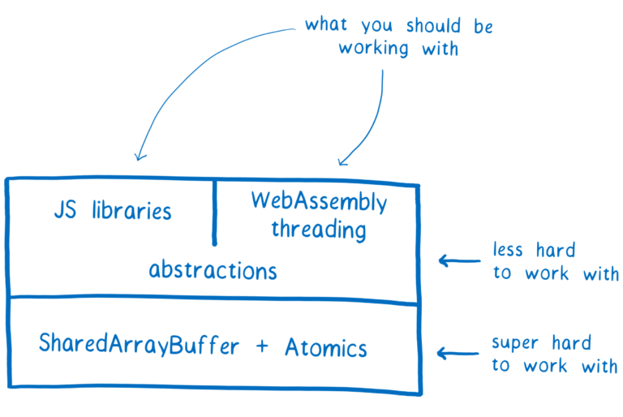

 * 原文地址：[A cartoon intro to ArrayBuffers and SharedArrayBuffers](https://hacks.mozilla.org/2017/06/a-cartoon-intro-to-arraybuffers-and-sharedarraybuffers/)
 * 原文作者：[Lin Clark](https://code-cartoons.com/)
 * 译者：[黑黑](#)
 * 校对者：[Bob](#)

 # 翻译 | 看图学习 ArrayBuffers 和 SharedArrayBuffers，秒变老司机 - 第二部（共三部）

在上一篇文章中，老司机带你了解了像 JavaScript 这样的语言是如何自动管理内存的。还解释了如何在 C 语言中手动管理内存。

我们为什么要在介绍 ArrayBuffers 和 SharedArrayBuffers 之前，先解释内存管理的知识呢？

这是因为，在 JavaScript 中，正是 ArrayBuffers 给你提供了手动管理内存的途径。

为什么要去手动管理内存呢？

正如我们在上一篇文章中谈到的关于自动内存管理的利弊：自动内存管理对开发人员来说比较友好。但它增加了一些额外的开销，在某些情况下，这些开销可能导致性能问题。

例如，当你在 JS 中创建变量时，引擎必须猜测它的数据类型，以及如何保存在内存中。因此，JS 引擎通常预留的空间比这个变量真正需要的空间大很多。根据变量的不同，内存分配可能会比实际需要的大2-8倍，这会导致大量的内存浪费。

此外, 某些创建和使用 JS 对象的模式会使收集垃圾变得更加困难。如果你手动管理内存的话, 可以根据实际使用需求来决定分配和释放内存的策略。

大多数时候, 这没什么大不了的。因为，大多数场景对性能要求并不苛刻，你无需手动管理内存。对于常见场景，手动内存管理甚至可能会更慢。

但是对于那些在底层需要极致优化的场景，ArrayBuffers 和 SharedArrayBuffers 就派上用场了。

### 那么 ArrayBuffer 怎么工作？

它基本上就像其它 JavaScript 数组一样。但是，ArrayBuffer 的元素必须是字节（可以用数字表示），对象或字符串这类的 JavaScript 类型的数据是不行的。

有一点我应该在这里明确指出，你并没有将这个字节直接添加到 ArrayBuffer 中。ArrayBuffer 本身并不知道字节应该有多大，也不知道不同的数字应该如何转换成字节。

ArrayBuffer 只是一串 0 和 1。它是不知道怎么拆分这个数组中各个元素的。

为了提供上下文信息，把 ArrayBuffer 拆分开，我们需要将它放在视图中。这些数据的视图可以添加类型化数组，并且有很多不同的类型数组可以使用。

例如，你可以使用 Int8 类型的数组，将 ArrayBuffer 分解为8位字节。

或者你可以用一个无符号的 Int16 类型数组，它可以将 ArrayBuffer 分解成16位不带符号整数。

同一 buffer 上可以有多个视图，不同的视图会为相同的操作提供不同的结果。

例如，我们从这个 ArrayBuffer 的 Int8 视图获取的元素，和从它的 Uint16 视图获取的元素就是不同的值，即使它们包含完全相同的 bits。

通过这种方式，ArrayBuffer 基本上就像原始内存，让你可以像使用 C 语言那样直接操作内存。

你可能会想知道为什么我们不让程序员直接访问内存，而是添加这一层抽象。这是因为直接访问内存将会打开一些安全漏洞。以后我会写一篇文章对此进行详细的解释。

### 那么 SharedArrayBuffer 是什么？

要解释 SharedArrayBuffers，我需要先解释一下并行运行代码和 JavaScript。

并行运行代码会使你的代码运行更快，也可以更快的响应用户的事件。要做到这一点，你需要先拆分工作。

在一个典型的应用中，所有工作全部单独由主线程来处理。主线程就像一个全栈开发者，它负责处理 JavaScript，Dom，和布局。

任何减少主线程工作负载的事对代码运行效率都是有帮助的。在某些情况下，ArrayBuffer 可以减少主线程的工作。

但有时仅仅减少主线程工作是不够的，你还需要一个增援来分担一部分工作。

大多数语言里，这种分割工作的方法可以使用多线程实现。这就像多人在一个项目上工作。如果有些任务是相互独立的且没有依赖，那么就可以把它们分配到不同线程上。然后，这些线程可以同时处理单独的任务。

在 JavaScript 中，可以通过 [web worker](https://developer.mozilla.org/en-US/docs/Web/API/Web_Workers_API/Using_web_workers) 来实现这些，但跟其他语言中的线程处理方式有些不同。默认情况下，它们不共享内存。

这意味着，如果想处理一些其他线程上的数据，你不得不通过 [postMessage](https://developer.mozilla.org/en-US/docs/Web/API/Worker/postMessage) 方法将数据完整的复制一份过来。

postMessage 会将你传进去的东西序列化，然后发送给另一个 web worker，那边会反序列化并放入内存中。

这是一个相当缓慢的过程。

对于某些数据，比如 ArrayBuffer，你还可以使用“转移内存”。这种方式会把指定区域的内存移动到另一个 web worker 那里。

但是之前的 web worker 将不再能访问这些被转移走的内存。

转移内存这种方式适用于某些场景，但是对于更多的高性能并行的场景，共享内存才是你真正想要的。

这就是 SharedArrayBuffers 能给你的。

有了 SharedArrayBuffers，多个 web workers，多个线程都可以在同一块内存上读写数据。

这意味着他们不会再有使用 postMessage 时的通讯开销和延迟。所有 web workers 都可以即时访问数据。

当然，多个线程同时访问内存是有风险的，这会引起条件竞争（race conditions）问题。

我会在下一篇中详细说明。

### SharedArrayBuffers 的支持情况

SharedArrayBuffers 即将在所有主流浏览器中支持。

Safari 10.1 已经支持了，Firefox 和 Chrome 的版本 将在7月或8月发布。而 Edge 计划在秋季 Windows 的更新中得到支持。

即使所有主流浏览器都支持了，我们也不指望应用开发者们直接使用它们。事实上，我们也不推荐直接使用。你应该使用的是最顶部的抽象层。

我们希望 JavaScript 库的开发者们开发出更简单安全的使用 SharedArrayBuffers 的库。

此外，一旦 SharedArrayBuffers 内置到平台中，WebAssembly 可以利用它实现多线程。到那时，你就可以使用像 Rust 这种以处理并发性为目标的语言一样轻松的处理多线程。

下一章，我们将介绍那些库开发者们构建抽象同时又避免条件竞争（race conditions）所使用的工具 [Atomics](https://developer.mozilla.org/en-US/docs/Web/JavaScript/Reference/Global_Objects/Atomics)。

